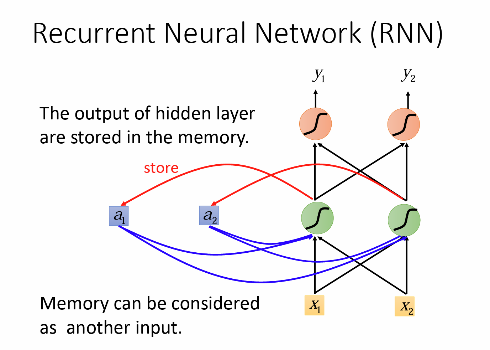
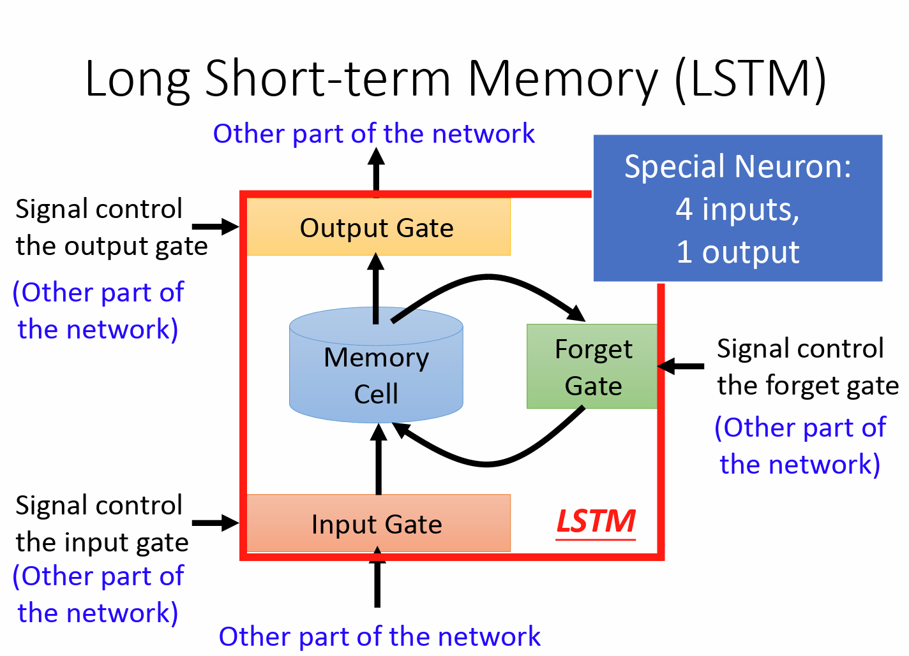
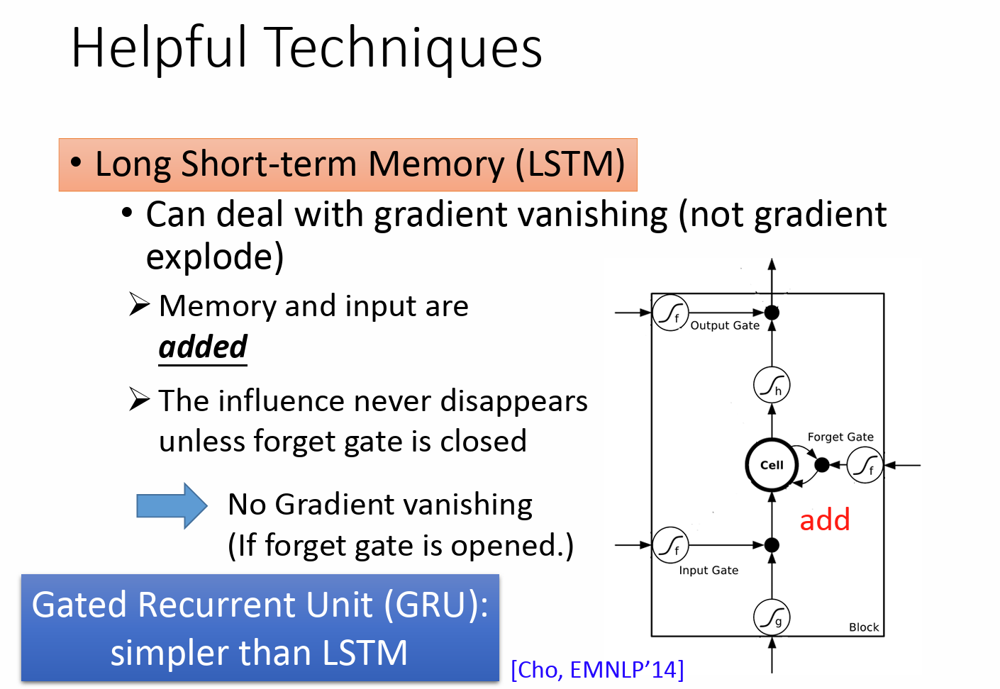
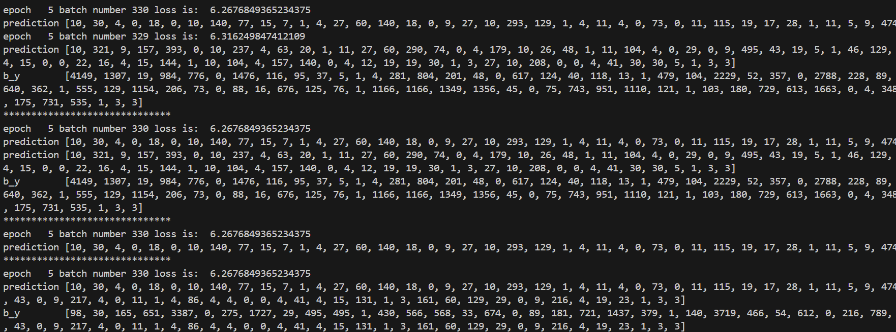
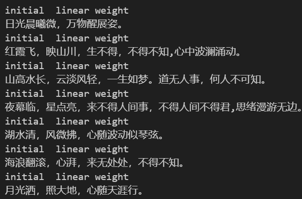

# 使用RNN、LSTM和GRU模型生成唐诗的实验报告

##### 2250409 罗尹泽

## 1. RNN、LSTM与GRU模型简介

### 循环神经网络（RNN）

循环神经网络（RNN，Recurrent Neural Network）是一种针对序列数据设计的神经网络结构。与传统的前馈神经网络不同，RNN能够处理变长的序列输入，这使其在自然语言处理、语音识别以及时间序列分析等应用中发挥重要作用。

RNN的关键特性在于它包含一个循环结构：网络的输出不仅依赖于当前的输入数据，还会受到之前状态的影响。通过这种设计，RNN能够记住先前的输入信息，从而在处理序列数据时捕捉时间动态。

RNN的核心组件：

- **隐藏状态（Hidden State）**：保存和更新时间序列中的信息。
- **输入权重（Input Weights）**：决定当前输入对隐藏状态的影响。
- **隐藏权重（Hidden Weights）**：决定前一个隐藏状态对当前隐藏状态的影响。

RNN的计算步骤如下：

1. 每个时间步接收一个输入，同时结合当前的隐藏状态。
2. 通过输入权重和隐藏权重计算新的隐藏状态。
3. 生成输出，输出可以直接作为当前时间步的结果，也可以作为进一步计算的基础。
4. 更新隐藏状态，继续处理下一时间步。

### 长短期记忆网络（LSTM）

LSTM（Long Short-Term Memory）是一种解决传统RNN在处理长序列时遇到的梯度消失和爆炸问题的改进方法，它能够更好地捕捉长时间依赖关系。

LSTM的独特设计在于其引入了“门控机制”，使其能够有效地处理信息的存储和删除。LSTM的主要组件包括：

- **细胞状态（Cell State）**：用于存储长期记忆。
- **输入门（Input Gate）**：决定哪些新信息需要加入细胞状态。
- **遗忘门（Forget Gate）**：决定哪些信息应该从细胞状态中删除。
- **输出门（Output Gate）**：决定细胞状态中的哪些信息将被输出。

LSTM的计算流程如下：

1. 输入门根据当前输入和前一时间步的隐藏状态更新细胞状态。
2. 遗忘门决定哪些信息从细胞状态中删除。
3. 输出门决定哪些细胞状态的信息需要输出，并生成新的隐藏状态。

### 门控循环单元（GRU）

GRU（Gated Recurrent Unit）是RNN的另一种变体，旨在简化LSTM结构。GRU通过引入两个门控机制——**更新门（Update Gate）**和**重置门（Reset Gate）**，来控制信息流的传递。

GRU的组件包括：

- **重置门（Reset Gate）**：决定当前输入对先前隐藏状态的影响程度。
- **更新门（Update Gate）**：决定当前计算的候选隐藏状态与旧隐藏状态的结合方式。

GRU的工作流程：

1. 计算重置门和更新门的值。
2. 使用重置门调整当前输入并计算候选隐藏状态。
3. 更新门决定是否使用候选隐藏状态替换旧的隐藏状态。

由于GRU的结构比LSTM简化，它在许多任务中展现出了与LSTM相当甚至更优的性能，尤其在处理较短序列时。

## 2. 诗歌生成流程

### TensorFlow版本的实现

#### 数据预处理

1. **数据读取**：`process_dataset`函数读取诗歌文件（poems.txt）并将每一行分割成标签和诗歌内容两部分。
2. **文本编码**：将文本内容转换为词汇索引，并为每个诗歌添加特殊的开始（bos）和结束（eos）标记。
3. **构建词汇表**：通过统计文本中的词汇，创建一个词汇映射字典（`word2id`）。
4. **数据格式化**：将文本转化为索引，并对其进行填充或截断以统一长度。
5. **数据集创建**：通过`poem_dataset`函数将处理后的数据转化为TensorFlow的数据集格式，并进行打乱和批量处理。

#### 模型结构

1. **嵌入层**：`embed_layer`将词汇索引转化为固定大小的嵌入向量。
2. **RNN层**：使用`SimpleRNNCell`作为基本单元，堆叠成RNN层处理序列数据。
3. **输出层**：通过全连接层（`Dense`）将RNN输出映射到词汇空间的概率分布。

#### 训练过程

1. **损失函数**：`compute_loss`计算交叉熵损失，并加权序列长度。
2. **优化器**：采用Adam优化器进行权重更新。
3. **训练循环**：`train_one_step`函数执行单步训练，计算损失并应用梯度更新。
4. **完整训练过程**：`train`函数执行多个周期，遍历数据集。

#### 文本生成

1. **初始化状态**：生成时初始化RNN状态。
2. **生成词汇**：从开始标记（bos）开始，生成后续词汇直到结束标记（eos）或最大长度。
3. **输出拼接**：将生成的词汇序列拼接成完整的诗歌。

#### 详细内容详见jupyter notebook。

### PyTorch版本的实现

由于CPU训练较慢，采用了GPU加速版本。

#### 数据处理

1. **读取诗歌**：`process_poems1`和`process_poems2`函数用于读取和清洗诗歌数据，去除不必要的符号。
2. **构建词汇表**：统计诗歌中的字符，创建一个字到索引的映射（`word_int_map`）。
3. **诗歌向量化**：将每首诗转化为字索引的序列。
4. **生成批次**：`generate_batch`将数据划分为多个批次进行训练。

#### 模型设计

1. **词嵌入层**：将字索引转换为嵌入向量。
2. **RNN层**：使用LSTM作为循环单元处理序列。
3. **输出层**：通过全连接层输出词汇空间的概率分布。
4. **激活函数**：使用`LogSoftmax`计算输出的概率。

#### 训练过程

1. **损失函数**：使用`NLLLoss`作为损失函数，衡量模型输出与实际标签之间的差异。
2. **优化器**：使用RMSprop优化器更新权重。
3. **训练循环**：`run_training`遍历每个训练周期，并进行反向传播。
4. **模型保存**：定期保存模型状态。

#### 生成诗歌

1. **生成过程**：`gen_poem`使用训练好的模型，从给定起始字开始生成诗歌。
2. **格式化输出**：`pretty_print_poem`对生成的诗歌进行格式化，提升可读性。

## 3. 生成诗歌

### 起始词汇

生成诗歌时使用了“日”、“红”、“山”、“夜”、“湖”、“海”和“月”等词汇作为起始字。

### 训练过程截图

### 生成诗歌结果

